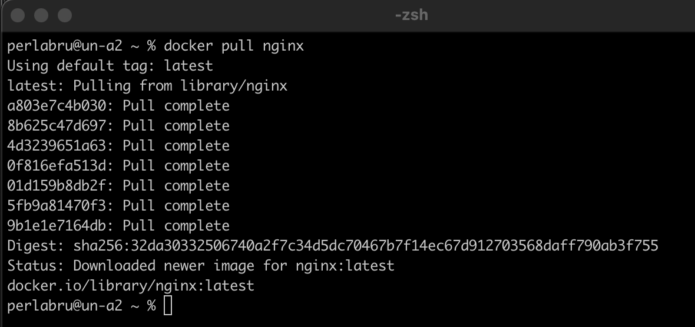
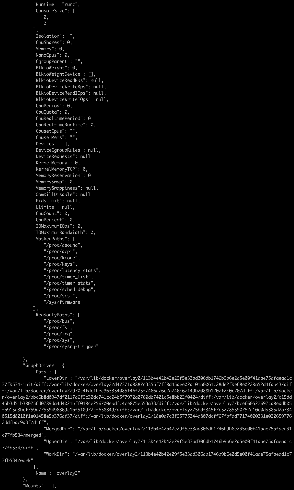
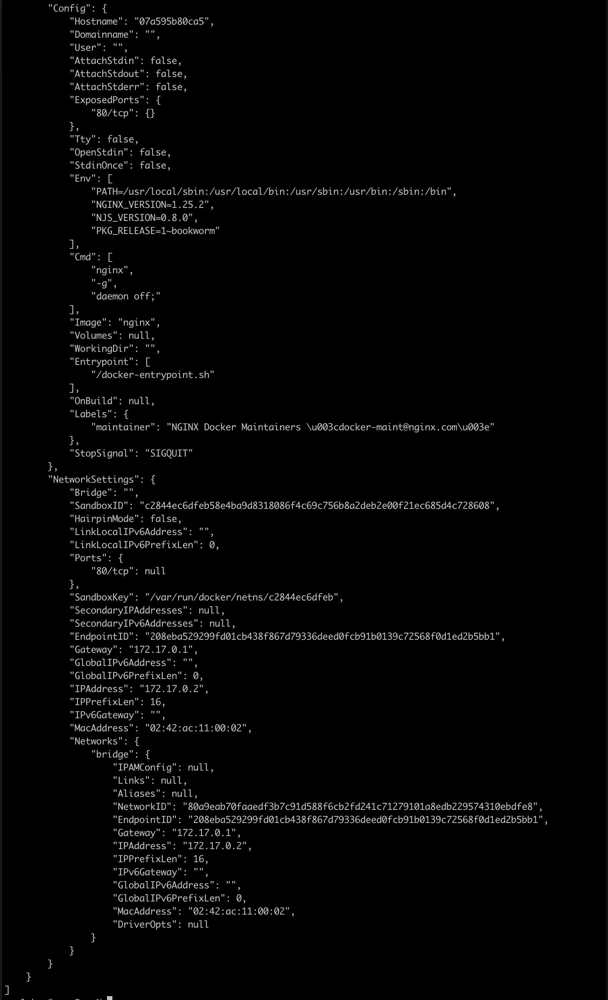
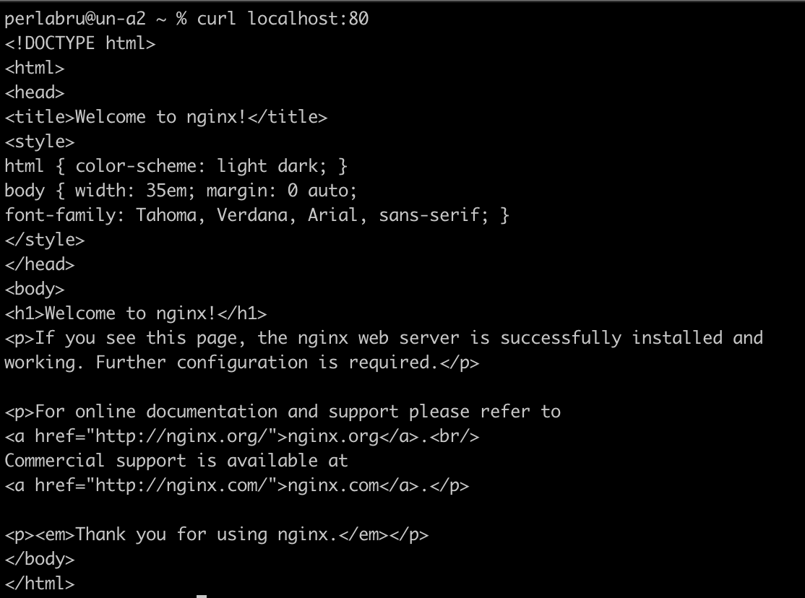
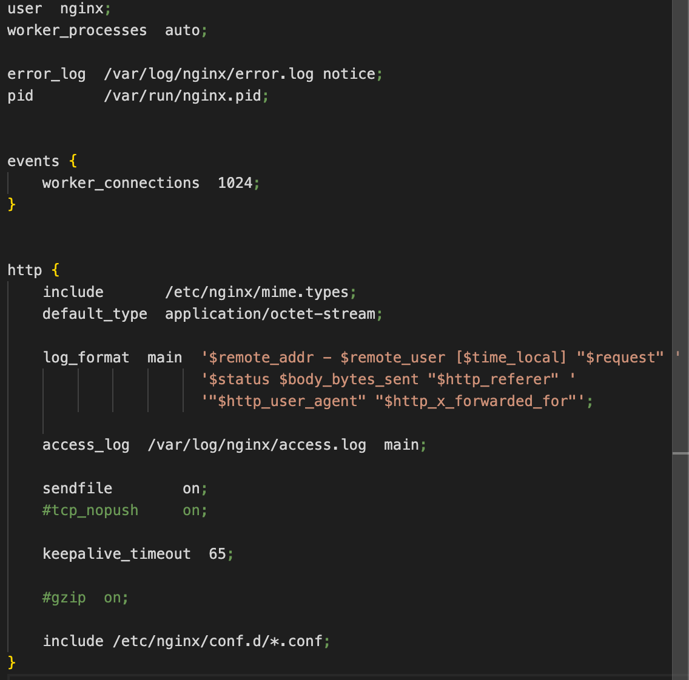
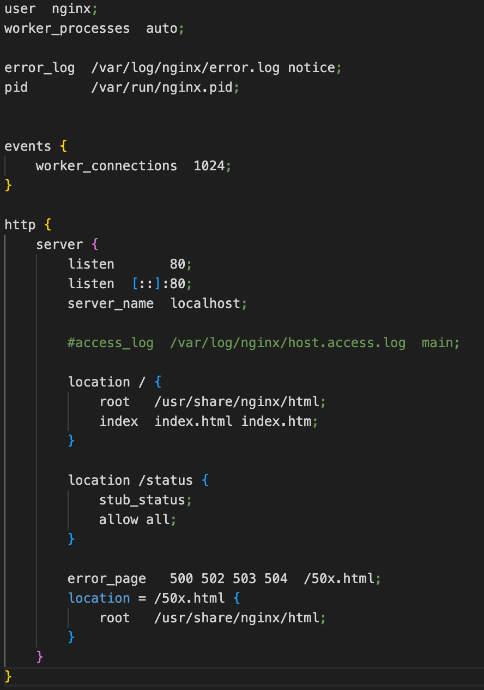
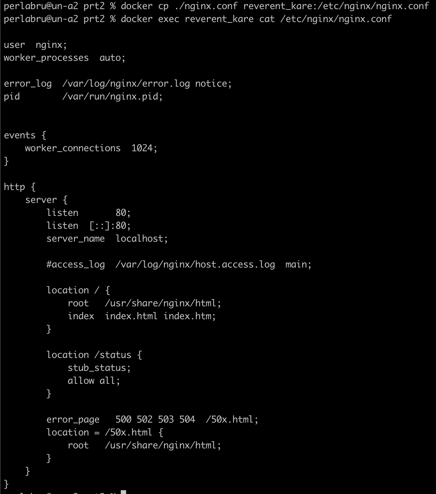
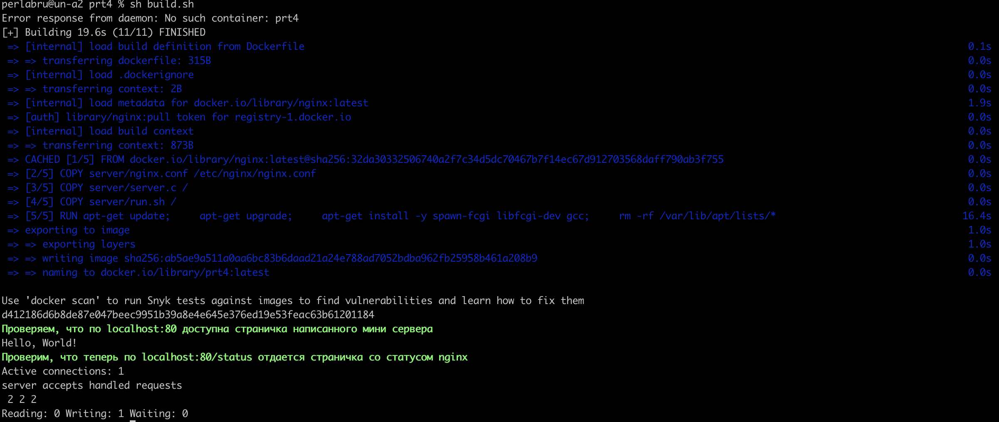
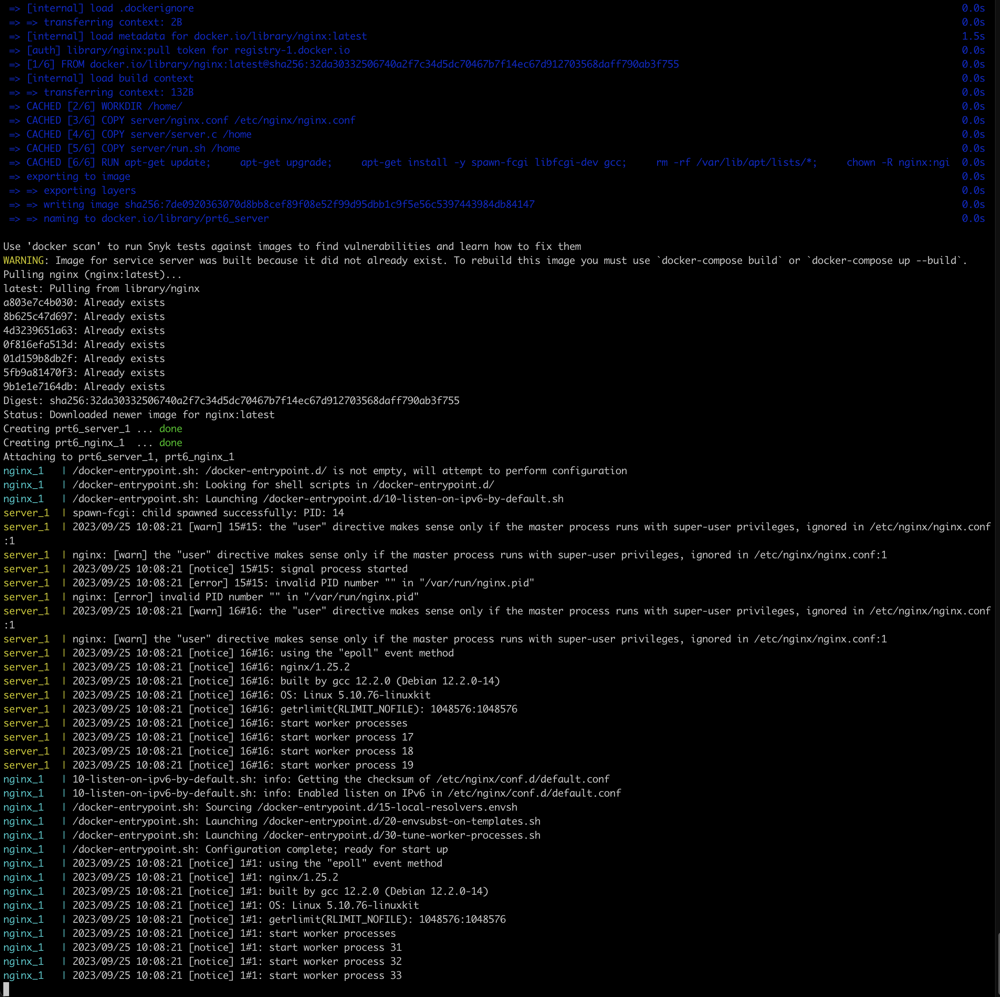

# **Simple Docker**

## **Содержание**

**Part 1. [Готовый докер](#part-1-готовый-докер)**

**Part 2. [Операции с контейнером](#part-2-операции-с-контейнером)**

**Part 3. [Мини веб-сервер](#part-3-мини-веб-сервер)**

**Part 4. [Свой докер](#part-4-свой-докер)**

**Part 5. [Dockle](#part-5-dockle)**

**Part 6. [Базовый Docker Compose](#part-6-базовый-docker-compose)**

---

## **Part 1. Готовый докер**

### **1. Взять официальный докер образ с nginx и выкачать его при помощи docker pull**
```
docker pull nginx
```


### **2. Проверить наличие докер образа через docker images**
```
docker images
```


### **3. Запустить докер образ через docker run -d [image_id|repository]**
```
docker run  -d nginx
```


### **4. Проверить, что образ запустился через docker ps**
```
docker ps
```


### **5. Посмотреть информацию о контейнере через docker inspect [container_id|container_name]**
```
docker inspect '07a595b80ca5'
```



>По выводу команды определить и поместить в отчёт размер контейнера, список замапленных портов и ip контейнера.
>- `Size`: 186639942
>- `ExposedPorts`: 80/tcp
>- `IPAddress`: 172.17.0.2

### **6.Остановить докер образ через docker stop [container_id|container_name] и проверить, что образ остановился через docker ps**
```
docker stop '07a595b80ca5'
docker ps
```


### **7. Запустить докер с портами 80 и 443 в контейнере, замапленными на такие же порты на локальной машине, через команду run**
```
docker run -p 80:80 -p 443:443 -d nginx
```


### **8. Проверить, что в браузере по адресу localhost:80 доступна стартовая страница nginx**
```
curl localhost:80
```



### **9. Перезапустить докер контейнер через docker restart [container_id|container_name] и проверить, что контейнер запустился**
```
docker restart reverent_kare
docker ps
curl localhost:80
```


## **Part 2. Операции с контейнером**

### **1. Прочитать конфигурационный файл nginx.conf внутри докер контейнера через команду exec**
```
docker exec reverent_kare cat /etc/nginx/nginx.conf
```


### **2. Создать на локальной машине файл nginx.conf**
```
docker exec reverent_kare cat /etc/nginx/nginx.conf > nginx.conf
```


### **3. Настроить в нем по пути /status отдачу страницы статуса сервера nginx**
***Содержимое файла до:***


***Измененный файл:***


### **4. Скопировать созданный файл nginx.conf внутрь докер образа через команду docker cp**
```
docker cp ./nginx.conf reverent_kare:/etc/nginx/nginx.conf
```


### **5. Перезапустить nginx внутри докер образа через команду exec**

***Проверка правильности написания файла конфигурации:***
```
docker exec reverent_kare nginx -t 
```


***Перезапуск nginx:***
```
docker exec reverent_kare nginx -s reload
```


### **6. Проверить, что по адресу localhost:80/status отдается страничка со статусом сервера nginx**
```
curl localhost:80/status
```


### **7. Экспортировать контейнер в файл container.tar через команду export**
```
docker export 611b37809c56 > container.tar
```


### **8. Остановить контейнер**
```
docker stop 611b37809c56
```


### **9. Удалить образ через docker rmi [image_id|repository], не удаляя перед этим контейнеры**
```
docker rmi -f nginx
```


### **10. Удалить остановленный контейнер**
```
docker rm 611b37809c56
```


### **11. Импортировать контейнер обратно через команду import**
```
docker import -c "ENTRYPOINT [\"/docker-entrypoint.sh\"]" \
-c "EXPOSE 80" \
-c "CMD [\"nginx\", \"-g\", \"daemon off;\"]" - myn:latest < container.tar
```


### **12. Запустить импортированный контейнер**
```
sudo docker run -d -p 80:80 -p 443:443 myn
```


### **13. Проверить, что по адресу localhost:80/status отдается страничка со статусом сервера nginx**
```
curl localhost:80/status
```


## **Part 3. Мини веб-сервер**

### **1. Написать мини сервер на C и FastCgi, который будет возвращать простейшую страничку с надписью Hello World!**

Напишем server.c
```c
#include <fcgi_stdio.h>
#include <stdio.h>

int main(void) {
    while (FCGI_Accept() >= 0) {
        printf("Content-Type: text/html\r\n");
        printf("Status: 200 OK\r\n\r\n");
        printf("Hello, World!\n");
    }
    
    return 0;
}
```
### **2. Запустить написанный мини сервер через spawn-fcgi на порту 8080**

* Запускаем докер-контейнер с маппингом на 81 порт
```
docker run -d -p 81:81 --name server-01 -it nginx /bin/bash
```

* Переносим файл server.c в контейнер
```
docker cp server.c server-01:/
```

* Перейдем в докер
```
docker exec -it server-01 /bin/sh
```

*Все дальнейшие шаги будут происходить внутри контейнера.*
* Теперь в докере установим необходимое ПО
```
apt-get update
apt-get upgrade
apt-get -y install libfcgi-dev spawn-fgci gcc
```
Скомпилируем server.c
```
gcc server.c -o server.fcgi -lfcgi
```

* Запускаем сервер
```
spawn-fcgi -p 8080 ./server
```

### **3. Написать свой nginx.conf, который будет проксировать все запросы с 81 порта на 127.0.0.1:8080**

* Создадим файл конфигурации ngnix.conf и пропишем его
```conf
user  nginx;
worker_processes  auto;

error_log /var/log/nginx/error.log notice;
pid /var/run/nginx.pid;

events {
    worker_connections  1024;
}

http {
    server {
        listen       81;

        location /status {
            stub_status; 
            allow all;
        }
        
        location / {
            fastcgi_pass 127.0.0.1:8080;
        }
    }
}
```
Перенесем файл в контейнер
```
docker cp ./nginx.conf server-01:/etc/nginx/nginx.conf
```

***Проверка правильности написания файла конфигурации:***
```
docker exec server-01 nginx -t 
```
***Перезапуск nginx:***
```
docker exec server-01 nginx -s reload
```

### **4. Проверить, что в браузере по localhost:81 отдается написанная вами страничка**


## **Part 4. Свой докер**

*Теперь всё готово. Можно приступать к написанию докер образа для созданного сервера.*

Докер образ будет должен собирает исходники из [3 части](#part-3-мини-веб-сервер)

Для начала припишем простой `Dockerfile`
```Dockerfile
FROM nginx:latest

COPY server/nginx.conf /etc/nginx/nginx.conf
COPY server/server.c /
COPY server/run.sh /

RUN apt-get update; \
    apt-get upgrade; \
    apt-get install -y spawn-fcgi libfcgi-dev gcc; \
    rm -rf /var/lib/apt/lists/*

ENTRYPOINT ["bash", "run.sh"]
```

Для упрощения сборки создадим `build.sh` и пропишем в нем основные правила сборки
```bash
#!/bin/bash

docker stop prt4 && docker rm -f prt4; \
docker build . -t prt4:latest -f Dockerfile; \
docker run -d -p 80:81 -v "$(pwd)/../nginx/nginx.conf:/etc/nginx/nginx.conf" --name prt4 prt4:latest
```

Также необходимо проверить, что сервер работает и отдает информацию по localhost.80. Добавим в `build.sh` проверку
```bash
sleep 1

printf "\e[0m\e[1;32m%s\e[0m\n" "Проверяем, что по localhost:80 доступна страничка написанного мини сервера"
curl localhost:80
printf "\e[0m\e[1;32m%s\e[0m\n" "Проверим, что теперь по localhost:80/status отдается страничка со статусом nginx"
curl localhost:80/status
```
### **Проверим:**
```
sh build.sh
```


## **Part 5. Dockle**

После написания образа никогда не будет лишним проверить его на безопасность.

### **Для начала установим `dockle`.**

[Установка на другие системы.](https://github.com/goodwithtech/dockle#installation)

Установка на школьные маки через brew:
```
brew install goodwithtech/r/dockle
```

Создадим файл `dockle_check.sh` чтобы удобно проверить образ
```bash
#!/bin/bash

docker stop prt5 && docker rm -f prt5; \
docker build . -t prt5:1.1 -f ./Dockerfile; \
docker run -d -p 80:81 -v "$(pwd)/../nginx/nginx.conf:/etc/nginx/nginx.conf" --name prt5 prt5:1.1

sleep 1

export DOCKER_CONTENT_TRUST=1
dockle --ignore CIS-DI-0010 -ak NGINX_GPGKEY prt5:1.1
```


Теперь исправим ошибки и предупреждения. Для этого избавимся от тэга latest, изменим Dockerfile и проверим ещё раз.


## **Part 6. Базовый Docker Compose**

```yml
services:
  server:
    build: ./../prt5/
  nginx:
    image: nginx:latest
    ports:
      - "80:8080"
    volumes:
      - ./nginx.conf:/etc/nginx/conf.d/default.conf
```

В этом файле описываем два сервиса `server` и `nginx`. Сервис server поднимает контейнер из [5 части](#part-5-dockle). Сервис nginx в свою очередь поднимает контейнер с nginx, который будет служить прокси, тоесть проксировать все запросы с 8080 порта на 81 порт первого контейнера. 

Запустим все и проверим.
```
docker-compose up
```



Проверим, что в браузере по localhost:80 отдается написанная страничка, как и ранее.

